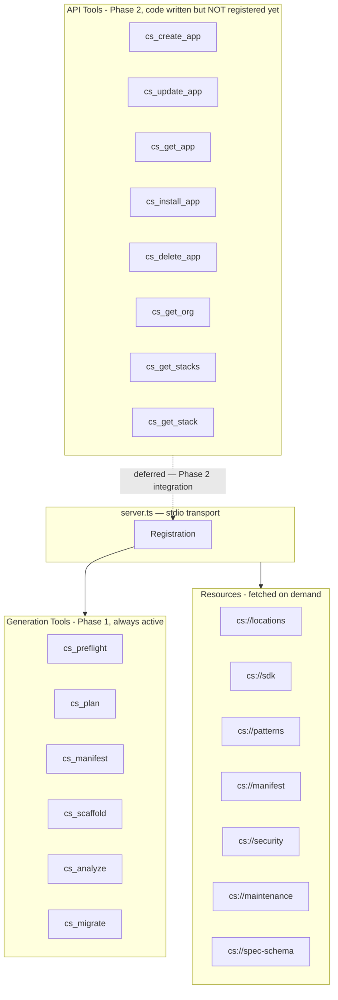
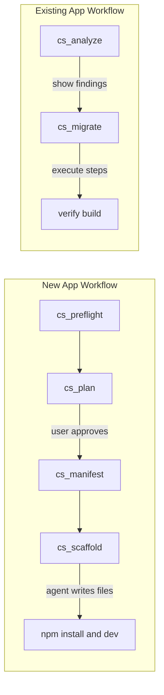

# Unified Contentstack App MCP — Execution Plan

## Architecture Overview



## Project Location

New folder: `contentstack-app-mcp/`

---

## Critical Design Principle: Tools Are Deterministic TypeScript, Not AI

MCP tools are TypeScript functions — they validate, transform, and return structured data. They do NOT interpret natural language or infer from intent. That is the LLM agent's job.

**Correct flow:**

1. LLM reads `cs://locations` resource → understands location types
2. LLM drafts a structured spec from user's natural language request
3. LLM calls `cs_preflight({ spec })` → tool validates the spec
4. LLM calls `cs_plan({ spec })` → tool returns confirmation prompt
5. LLM shows confirmation to user, waits for approval
6. LLM calls `cs_manifest({ spec })` → generates manifest
7. LLM calls `cs_scaffold({ spec, category })` 3 times — "infrastructure", "routing", "locations" — writes returned files to disk each time

Tool descriptions are instructions TO the LLM about what to do before/after calling. The tool code itself only validates + transforms.

---

## Phase 1 — Project Scaffold

### `package.json`

```json
{
  "name": "contentstack-app-mcp",
  "version": "1.0.0",
  "type": "module",
  "main": "dist/server.js",
  "scripts": {
    "build": "tsc",
    "start": "node dist/server.js",
    "dev": "tsx watch src/server.ts"
  },
  "dependencies": {
    "@modelcontextprotocol/sdk": "1.27.1",
    "zod": "^3.25",
    "@cfworker/json-schema": "^4.1.1"
  },
  "devDependencies": {
    "typescript": "^5",
    "tsx": "latest",
    "@types/node": "latest"
  }
}
```

### Folder Structure

```
contentstack-app-mcp/
├── src/
│   ├── server.ts
│   ├── tools/
│   │   ├── generation/
│   │   │   ├── index.ts
│   │   │   ├── preflight.ts
│   │   │   ├── plan.ts
│   │   │   ├── manifest.ts
│   │   │   ├── scaffold.ts
│   │   │   ├── analyze.ts
│   │   │   └── migrate.ts
│   │   └── api/                   # code-only, NOT registered in Phase 1
│   │       ├── apiClient.ts
│   │       ├── create-app.ts
│   │       ├── update-app.ts
│   │       ├── get-app.ts
│   │       ├── install-app.ts
│   │       ├── delete-app.ts
│   │       ├── get-org.ts
│   │       ├── get-stacks.ts
│   │       └── get-stack.ts
│   ├── prompts/
│   │   ├── index.ts
│   │   ├── venus.ts               # cs_venus
│   │   ├── workflow.ts            # cs_workflow
│   │   └── migrate-check.ts       # cs_migrate_check
│   └── resources/
│       └── loader.ts
├── knowledge/
│   ├── locations.md               # cs://locations
│   ├── sdk.md                     # cs://sdk
│   ├── patterns.md                # cs://patterns (full Venus reference)
│   ├── manifest.md                # cs://manifest
│   ├── security.md                # cs://security
│   ├── maintenance.md             # cs://maintenance
│   └── spec-schema.json           # cs://spec-schema
├── .gitignore
├── package.json
└── tsconfig.json
```

---

## Phase 2 — Knowledge Files

All 7 files are markdown/JSON, read at runtime from `knowledge/`. No recompile needed to update them.

### `knowledge/locations.md` → `cs://locations`

Each of 10 location types includes:

- `manifest_type` string (e.g., `cs.cm.stack.custom_field`)
- Route path (e.g., `/custom-field`)
- SDK location key (e.g., `location.CustomField`)
- Available SDK interface (`{ entry, field, fieldConfig, frame, stack }`)
- Field-level constraints — `cbModal` ban on CustomField

### `knowledge/sdk.md` → `cs://sdk`

SDK capabilities, inline picker pattern, FieldModifier frame API.

### `knowledge/patterns.md` → `cs://patterns`

Venus component reference, `@ts-ignore` pattern, hooks.

### `knowledge/manifest.md` → `cs://manifest`

Developer Hub manifest format, advanced_settings configuration.

### `knowledge/security.md` → `cs://security`

4-tier security model, permissions, API key management.

### `knowledge/maintenance.md` → `cs://maintenance`

Migration checklist, analysis rules, verification patterns.

### `knowledge/spec-schema.json` → `cs://spec-schema`

JSON schema for validating app specifications.

---

## Phase 4 — Generation Tools

### `cs_preflight`

Validates a structured spec and infers security tier + permissions.

- Input: `{ spec: object }`
- Output: `{ valid: boolean, errors: string[], warnings: string[], security_tier: 1|2|3, inferred_permissions: string[], needs_app_config: boolean }`

### `cs_plan`

Stateless confirmation gate — validates spec and returns confirmation_prompt.

- Input: `{ spec: object }`
- Output: `{ success, confirmation_prompt, security_tier, warnings }`

### `cs_manifest`

Generates manifest.json from spec.

- Input: `{ spec: object, base_url?: string }`
- Output: `{ manifest: object }`

### `cs_scaffold`

Generates source files by category.

- Input: `{ spec: object, category: "infrastructure" | "routing" | "locations" }`
- Output: `{ category: string, files: [{ path: string, content: string }] }`

### `cs_analyze`

Audits an existing repo against Contentstack best practices.

- Input: `{ repo_path: string }`
- Output: analysis object with issues, structure_type, versions

### `cs_migrate`

Generates ordered migration plan from cs_analyze output.

- Input: `{ analysis: object }`
- Output: `{ do_not_change: string[], steps: MigrationStep[] }`

---

## Phase 5 — API Tools (Code Only — NOT Registered)

> **Deferred:** These tools will be integrated in a future phase when Developer Hub API integration is evaluated.

| Tool             | Method | Endpoint                          |
| ---------------- | ------ | --------------------------------- |
| `cs_create_app`  | POST   | `/manifests`                      |
| `cs_update_app`  | PUT    | `/manifests/{app_uid}`            |
| `cs_get_app`     | GET    | `/manifests/{app_uid}`            |
| `cs_install_app` | POST   | `/manifests/{app_uid}/install`    |
| `cs_delete_app`  | DELETE | `/manifests/{app_uid}`            |
| `cs_get_org`     | GET    | `/organizations/{org_uid}`        |
| `cs_get_stacks`  | GET    | `/organizations/{org_uid}/stacks` |
| `cs_get_stack`   | GET    | `/stacks/{stack_api_key}`         |

---

## End-to-End Workflow


