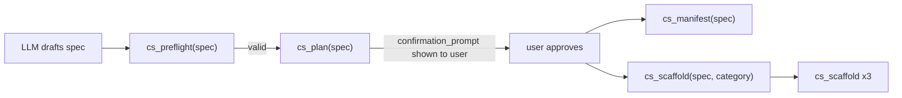

# MCP Simplification — plan_id Removal + Auto-Trigger Rule

## Overview

Two targeted changes to the MCP:

1. **Remove plan_id and disk state** — `cs_manifest` and `cs_scaffold` take `spec` directly, `cs_plan` becomes a stateless confirmation gate
2. **Add Cursor workspace rule** — generic "build an app" prompts auto-trigger the MCP workflow without users naming tools

## Change 1 — Remove plan_id (Stateless Workflow)

### What changed

Previously: `cs_plan` wrote the spec to disk and returned a `plan_id`. `cs_manifest` and `cs_scaffold` read from disk using that `plan_id`.

**New design:** `cs_plan` is a stateless confirmation gate — it validates the spec and returns a formatted `confirmation_prompt` for the user. No disk write, no `plan_id`. `cs_manifest` and `cs_scaffold` accept `spec` directly.

### New flow



### Files changed

- `src/tools/generation/plan.ts` — removed `savePlan()`, returns `{ success, confirmation_prompt, security_tier, warnings }`
- `src/tools/generation/manifest.ts` — schema now `{ spec, base_url? }` instead of `{ plan_id, base_url? }`
- `src/tools/generation/scaffold.ts` — schema now `{ spec, category }` instead of `{ plan_id, category }`
- `src/prompts/workflow.ts` — updated instructions to pass `spec` directly

### Files deleted

- `src/store/plan-store.ts` — no longer needed
- `.plan-store.json` — runtime file removed

---

## Change 2 — Cursor Workspace Rule for Auto-Triggering

### What it does

A `.cursor/rules/` file automatically injected into every agent context for this workspace. When the user says anything resembling "build an app", "create a dashboard widget", "make a sidebar", etc., the agent reads the rule and invokes the MCP workflow — without the user needing to name any tools.

### File created

`.cursor/rules/contentstack-mcp-workflow.mdc`

```markdown
---
description: Contentstack Marketplace App Development — MCP Workflow
globs: ["**/*"]
alwaysApply: true
---

# Contentstack App Development

When the user asks to build, create, develop, or generate a Contentstack app,
marketplace app, UI extension, custom field, sidebar widget, dashboard widget,
full page app, or any Contentstack location-based component:

## ALWAYS use the contentstack-apps MCP tools in this order:

1. Read `cs://locations` — understand all UI location types before choosing one
2. Read `cs://security` — determine correct security tier for external APIs
3. Read `cs://patterns` — understand Venus components before writing any UI code
4. Draft a structured spec from the user's intent
5. Call `cs_preflight({ spec })` — validate the spec
6. Call `cs_plan({ spec })` — get confirmation_prompt, show it to the user, WAIT for approval
7. After approval: call `cs_manifest({ spec })` — generate manifest.json, write to disk
8. Call `cs_scaffold({ spec, category: "infrastructure" })` — write returned files to disk
9. Call `cs_scaffold({ spec, category: "routing" })` — write returned files to disk
10. Call `cs_scaffold({ spec, category: "locations" })` — write returned files to disk
11. Run `npm install && npm run dev`

## For migrating an existing app:
1. Call `cs_analyze({ repo_path })` — audit the repo
2. Show findings to user grouped by severity
3. Call `cs_migrate({ analysis })` — get ordered migration steps
4. Execute steps one at a time, verify build passes after each

## Rules:
- NEVER write Contentstack app code from scratch without going through cs_preflight first
- NEVER use raw fetch() or axios() — always use callProxyApi() from useApi() hook
- NEVER use Venus components without the @ts-ignore import comment
- NEVER use cbModal inside a Custom Field location
- ALWAYS use Venus components (cs://patterns) for all standard UI elements
```

This file uses `alwaysApply: true` so it fires on every agent message in this workspace, not just when the user explicitly opens a Contentstack-related file.
